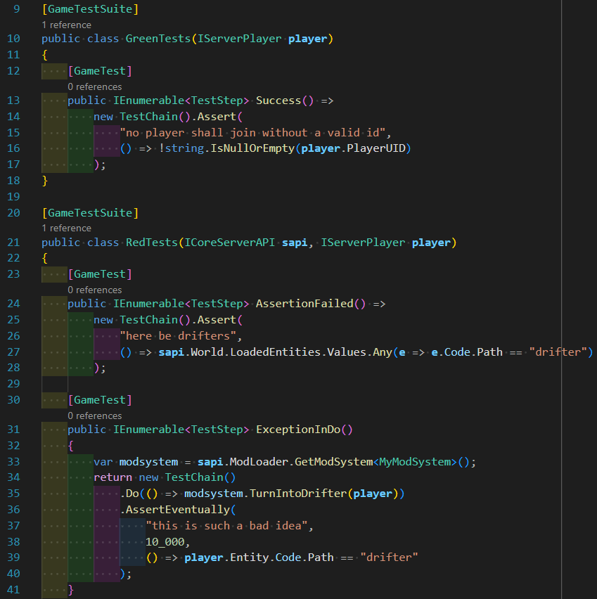

# VinTest — in-game testing framework for Vintage Story mods



# What does it do

VinTest lets you write automated tests for your Vintage Story mod that run inside the actual game.
Instead of guessing whether your code works, you launch VS with a companion test mod loaded alongside
your real mod, and the framework verifies your logic, then exits the game and reports the results.

You get three layers, №2 and №3 optional:

1. **Core** (`VinTest`) — the in-game test runner.
   Write test classes in C#, launch VS, read results in the log file.
   No other tooling required.
2. **Cake task** (`VinTest.Cake`) — automates the full cycle: build both mods, launch VS, collect
   results, print a summary.
   Uses [Cake](https://cakebuild.net/), which is included in popular VS mod templates — chances are it
   is already present in your codebase.
3. **VS Code extension** (`vintest-vscode`) — surfaces test results directly in the VS Code Test
   Explorer, with clickable failure locations.

# How do I use it

[`example/`](example/) has a complete working setup you can copy from.

## Prerequisites

- .NET SDK (8.0 or later)
- VintageStory installation
- World save and (preferably) a custom game data directory where it lives in.
  Save must be fully initialized: player must have a character and spawned in at least once, in order for
  tests to work properly.

## Step 1 — Create a test mod project

Create a new C# project (e.g. `YourMod.gametests`) and reference VinTest, your main mod, and the
VintageStory API:

```xml
<!-- YourMod.gametests.csproj -->
...
    <ProjectReference Include="../YourMod/YourMod.csproj">
      <Private>false</Private>
    </ProjectReference>
    <PackageReference Include="VinTest" Version="0.0.0" />
    <Reference Include="VintagestoryAPI">
      <HintPath>$(VINTAGE_STORY)/VintagestoryAPI.dll</HintPath>
      <Private>false</Private>
    </Reference>
...
```

## Step 2 — Write test suites

A test suite is a plain class marked with `[GameTestSuite]`.
Each test method is marked with `[GameTest]` and returns an `IEnumerable<TestStep>` built with `TestChain`.

```cs
[GameTestSuite]
public class TestsForYourMod
{
    [GameTest]
    public IEnumerable<TestStep> MathWorks() {
        return new TestChain().Assert(
            "summation is a good thing",
            () => {
                return 2 + 2 == 4;
            }
        );
    }
}
```

## Step 3 — Create the test ModSystem

Instead of the regular `ModSystem`, inherit from `GametestModsystemBase` and return your suite
instances from `CreateSuites()`:

```cs
public class YourTestModSystem : GametestModsystemBase
{
    protected override object[] CreateSuites(IServerPlayer player)
    {
        return [new YourTestSuite()];
    }
}
```

## Step 4 — Run

Build both mods and launch VS:

```
VintageStory.exe --addModPath "YourMod\bin\Debug\Mods" "YourMod.gametests\bin\Debug\Mods" --dataPath "./gamedata" --openWorld "autotest"
```

Once VS fully launches and the world is loaded, the `.gametests` mod will run all tests, and exit.
`gamedata/Logs/server-main.log` and look for `[VinTest]` lines:

```
19.5.2026 13:22:45 [Notification] [VinTest] > > >  TestsForYourMod.MathWorks
....
19.5.2026 13:22:45 [Notification] [VinTest] Suite 'TestsForYourMod': 1/1 passed
```

## Step 5 — Automate with Cake (recommended)

If your project uses [Cake](https://cakebuild.net/), add the `VinTest.Cake` package to your
CakeBuild project:

```xml
<!-- CakeBuild.csproj -->
    <PackageReference Include="VinTest.Cake" Version="0.0.0" />
```

Make your `BuildContext` inherit from `ContextBase` and provide your project name:

```cs
public class BuildContext : ContextBase
{
    public override string ProjectName => "YourMod";

    public BuildContext(ICakeContext context) : base(context) { }
}
```

Add a task:

```cs
[TaskName("RunGameTests")]
public sealed class RunGameTestsTask : GameTestsTaskBase<BuildContext> { }
```

Then run everything with one command:

```
dotnet run --project ./CakeBuild -- --vs-path "D:/VintageStory/1.21.7"
```

Cake will build both mods, launch VS, wait for results, and print a human-readable summary.
By default, It will use `gamedata/` directory near your mod project (configurable with `--data-path` parameter) and world name `autotest` (configurable with `--test-world`).

# How does it work

## Core framework

[`VinTest/`](VinTest/) is a C# library that gets compiled into your test mod.
When the test mod loads, it waits for a player to spawn, then runs all test suites and exits the game.

**Key types:**

- `[GameTestSuite]` / `[GameTest]` — attributes that mark your test classes and methods.
  The runner discovers tests automatically at startup based upon these.

- `GametestModsystemBase` — the base class for your test to use instead of `ModSystem`.
  Handles player-join detection, suite startup, and clean exit.

- `TestChain` — a fluent builder that describes what a test does, step by step.
  Steps are provided as callbacks rather than plain imperative code, so the runner can interleave them
  with the game loop (e.g. to wait for an entity to spawn before asserting something about it).

---

## Cake helpers

[`VinTest.Cake/`](VinTest.Cake/) is a C# library for [Cake](https://cakebuild.net/) that drives the
full test lifecycle: it builds both mod projects, launches `VintageStory.exe` with the right
arguments and reports results.

**Key types:**

- `ContextBase` — base class for your `BuildContext` in `Program.cs`.
  Parses all VinTest-specific CLI arguments and exposes them as typed properties.

- `GameTestsTaskBase<TContext>` — base class for your Cake task to run tests.
  Handles building, launching VS, and reading `results.json`.
  Provides many customization points to adjust for your mod behavior.

---

## VS Code extension

[`vscode/`](vscode/) hosts a Visual Studio Code extension that brings VinTest test discovery and
execution into the native **Test Explorer** UI.

- Scans `.cs` files for `[GameTestSuite]` / `[GameTest]` attributes and populates the Test Explorer tree
- Runs tests by invoking your Cake build project (`dotnet run --project CakeBuild`)
- Parses `results.json` and surfaces pass/fail statuses with clickable assertion locations
