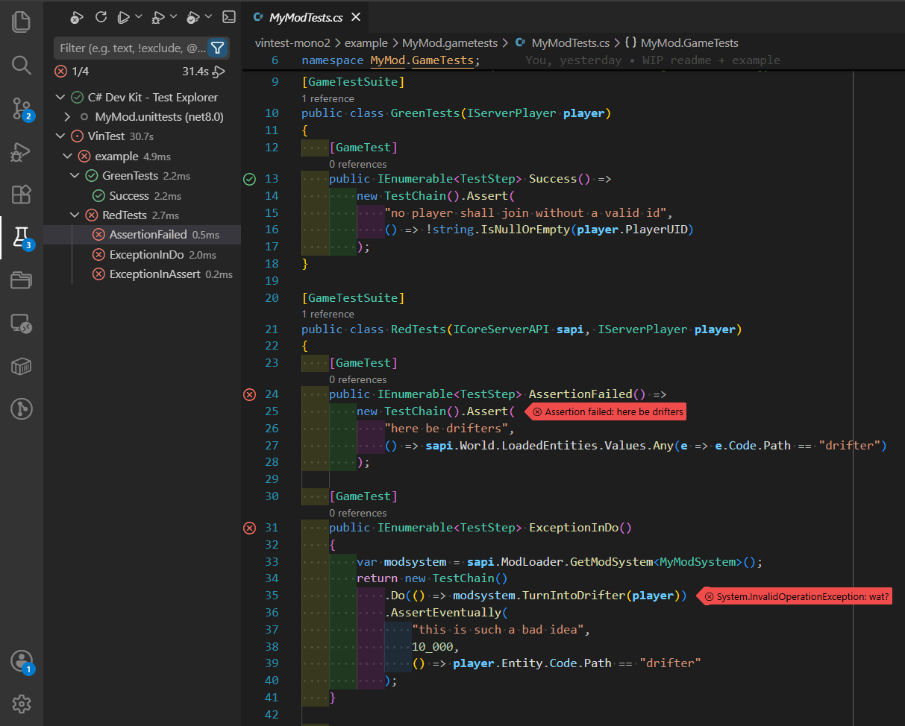

---

> [!WARNING]
> **Not for the faint of heart!**
>
> _Extremely_ vibecoded, proceed at your own peril.

## Usage

- No `.vsix` is provided yet; you will need to build the extension from source via `npm run compile`
- Install via `Developer: Install extension from location...` command in VS Code
- Open a workspace that contains your mod, test mod, and Cake project — tests should appear in
  the Testing tab automatically
- Use the `vintest.*` settings to configure it to your liking

### If you have regular unit tests in your mods...

... and use other extension like `C# Dev Kit` or `DotRush` to run these tests, VinTest **_will_**
conflict with them.

Other test controllers use `dotnet build` to build the project/solution, VinTest will use
`dotnet build` + `dotnet run` on same projects, the commands will conflict over same DLLs — and
there seems to be no mechanism in VS Code to schedule them or at least predict that conflict is possible.

In such case, setting `"vintest.waitForOtherTests": 5000` will postpone VinTest controller startup,
so it has better chance to see another `dotnet build` process and wait for it to stop.

### If you have multiple mods in your workspace...

... you are in for another weird sort of conflicts.

The extension will spin up `dotnet run --project Cake`s one by one for each detected mod, using
separate local `gamedata/` directories.
This will cause Vintage Story authorization to lose its mind, constantly asking you to re-login
for each new VS launch.
To avoid this, you can tweak your extension settings to make sure all projects are using the same
`--data-path/` directory.

Depending on what your mods do, sharing their datapath might or might not cause unexpected issues.
As alternative, you can make sure that _all_ of your `<mod>/gamedata/clientsettings.json`s:

- have the same values in `sessionkey`, `sessionsignature` and `useremail` parameters,
- and the values were copied from the latest successful launch+login

#### Q: session, key, signature, email? wtf?? is ur AI slop stealin muh passwords?!

**A**: ey don' need yer passwads!
It is (presumably) just VS doing its job to fight pirates.
How it goes:

- You launch VS with **new** datapath `A/`
  - settings there contain no login information, so you need to login
- Once you successfully login, VS auth server issues you a **fresh login session** №1
- You launch VS with **same** datapath `A/` again
  - settings there now have a valid login session; game starts without asking for password
- You launch VS with another **new** datapath `B/`
  - no login info there either
- VS auth issues you **another login session** №2, **_and invalidates №1_**
- You launch VS with **existing** datapath `A/`
  - settings there now contain **expired** login info, so you have to login again
- VS auth issues session №3, and invalidates №2
- You **copy** your login information from `A/` to `B/`
  - their settings now have the same valid login info
  - VS auth cares only about that, and does not discern two different datapaths
  - game starts without asking for password

Your password never gets stored in the file, only your (temporary) session details.
VS is free to expire them at a moment's notice — either on its own, or if you reset the password
on the account page.
